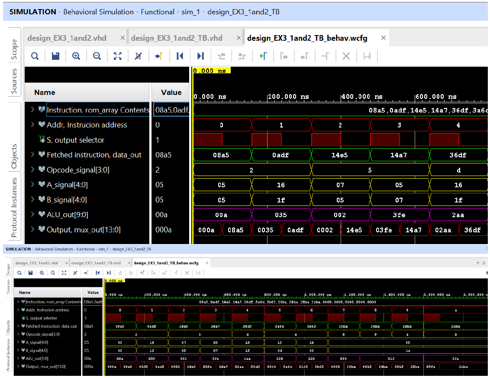

# fpga-rom-alu-system
ROM–ALU system on Basys-3 with custom IP integration using Vivado
# FPGA Project: ROM–ALU System with Custom IP Integration (Basys-3)

📅 **Degree**: B.S/M.S. in Electrical and Computer Engineering
📅 **Course**: Reconfigurable Computing/FPGA Project  
🏫 **University**: University at Albany, SUNY  
👨‍🏫 **Instructor**: Dr. James R. Moulic  
📍 **Platform**: Xilinx Vivado + Basys-3 FPGA board  

---

## 🛠️ Project Overview

This FPGA project demonstrates a 3-part pipeline:

1. **Part 1 – RTL Simulation**: Design and simulation of a ROM-to-ALU datapath in Vivado using VHDL.
2. **Part 2 – IP Packaging**: The RTL module is packaged as a reusable **custom IP** using Vivado’s Packager tool.
3. **Part 3 – IPI Block Design**: The packaged IP is instantiated inside a Vivado IP Integrator (IPI) project, with HDL wrappers and testbenches created for functional verification.

The system reads instructions from a ROM, decodes them, and executes operations like `ADD`, `SUB`, `XOR`, `DIV`, and `SPECIAL` using the ALU.

---

## ⚙️ Technologies Used

- **Vivado** (HDL & IP Design)
- **VHDL** (RTL modeling, wrapper, testbenches)
- **Xilinx IP Catalog** (IP packaging & integration)
- **Basys-3 FPGA Board**

---

## 📥 Final Report

📘 [Download Final Report (PDF)](Report/Report_Design_EX_3.pdf)

---

## 🧩 Project Structure

```

├── Code/
│ ├── design_EX3_1and2
│ ├── IP_design3_Q3_Before modify
│ ├── IP_design3_Q3
├── images/
│ ├── VHDL_Source.png
│ ├── VHDL_Testbench.png
│ ├── Simulation.png
├── Board_Image/
│ ├── Image-Part_1st
│ ├── Block_Design
│ ├── Image-Part_3rd
├── Report/
│ └── Report_Design_EX_3.pdf
├── README.md

```

---

## 💻 Project Features

- ✅ ROM instruction format: 13-bit binary encoding
- ✅ Supports basic ALU operations (ADD, SUB, XOR, DIV, etc.)
- ✅ Custom IP packaged and reused in IP Integrator (IPI)
- ✅ HDL wrapper and testbench created for simulation
- ✅ Fully verified timing waveform and board execution
---

## 🖼️ Results


### 📈 Vivado Simulation


### 🧪 Basys-3 Output Examples

| Address | Operation | S | Output |
|---------|-----------|---|--------|
| `0010`  | ADD       | 1 | ✅ Verified |
| `0101`  | Division  | 1 | ✅ Verified |
| `1101`  | Subtract  | 1 | ✅ Verified |
| `1110`  | Special Op| 1 | ✅ Verified |
| `1001`  | XOR       | 1 | ✅ Verified |

*See actual board photos in `/Board_Image`.*

---

## 📥 Downloads

- 📘 [Final Report (PDF)](Report/Report_Design_EX_3.pdf)
- 🔗 [View on GitHub](https://github.com/drsarojshah/fpga-rom-alu-system)

---

## 📫 Contact

📧 engsarojshah@gmail.com  
🔗 [LinkedIn](https://linkedin.com/in/saroj-s-763265226)  
🌐 [Portfolio Website](https://drsarojshah.github.io)

---

> ⚠️ *Note*: This project demonstrates RTL design to IP-based system integration, suitable for embedded/FPGA design roles.
